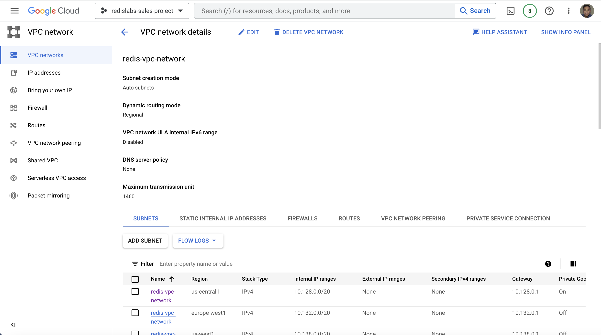

# Lab 2: Create Google Cloud Infrastrcuture Components

Create a VPC:
```bash
export VPC_NETWORK="redis-vpc-network"
export SUBNETWORK=$VPC_NETWORK
gcloud compute networks create $VPC_NETWORK \
    --subnet-mode=auto
```
     
On success, you should view your VPC network as follows:

    

Reserve external static IP addresses:
```bash
gcloud compute addresses create redis-api-gateway-ip --region us-central1
export REDIS_API_GATEWAY_IP="$(gcloud compute addresses describe redis-api-gateway-ip --region=us-central1 --format='value(address)')"
```
```bash
gcloud compute addresses create redis-client-host-ip --region us-central1
export REDIS_CLIENT_HOST_IP="$(gcloud compute addresses describe redis-client-host-ip --region=us-central1 --format='value(address)')"
```    

On success, you should see the newly created reserved public IP addresses as shown below:


Create a GKE cluster:
```bash
export PROJECT_ID=$(gcloud info --format='value(config.project)')
export PROJECT_NUMBER=$(gcloud projects list --filter="$PROJECT_ID" --format="value(PROJECT_NUMBER)")
export CLUSTER_LOCATION=us-central1
export CLUSTER_NAME="redis-gke-cluster-$CLUSTER_LOCATION"

gcloud container clusters create $CLUSTER_NAME \
    --project=$PROJECT_ID \
    --region=$CLUSTER_LOCATION \
    --machine-type=e2-standard-8 \
    --network=$VPC_NETWORK \
    --subnetwork=$SUBNETWORK \
    --num-nodes=1 \
    --workload-pool=${PROJECT_ID}.svc.id.goog \
    --labels="mesh_id=proj-${PROJECT_NUMBER}"
```

On success, you should see your newly created GKE cluster like below:


Provision Anthos Service Mesh:
Enable Anthos Service Mesh on your project's Fleet:
```bash
gcloud container fleet mesh enable --project $PROJECT_ID
```
Register the cluster to the project's Fleet:
```bash
gcloud container fleet memberships register $CLUSTER_NAME-membership \
  --gke-cluster=${CLUSTER_LOCATION}/${CLUSTER_NAME} \
  --enable-workload-identity \
  --project ${PROJECT_ID}
```
Provision managed Anthos Service Mesh on the cluster using the Fleet API:
```bash
gcloud container fleet mesh update \
  --management automatic \
  --memberships ${CLUSTER_NAME}-membership \
  --project ${PROJECT_ID}
```
Wait for about ~10 minutes and run the command below to verify ASM is enabled:
```bash
gcloud container fleet mesh describe --project $PROJECT_ID
```
You should see the following states equal to `ACTIVE`  when the installation of Anthos Service Mesh has been completed:
```bash
membershipStates:
  projects/319143195410/locations/us-central1/memberships/redis-gke-cluster-us-central1-membership:
    servicemesh:
      controlPlaneManagement:
        details:
        - code: REVISION_READY
          details: 'Ready: asm-managed'
        state: ACTIVE
      dataPlaneManagement:
        details:
        - code: OK
          details: Service is running.
        state: ACTIVE
```
Enable "default" namespace for sidecar injection
```bash
kubectl label namespace default istio-injection=enabled istio.io/rev-
```
You should see the following output on success:
```bash
label "istio.io/rev" not found.
namespace/default labeled
```


